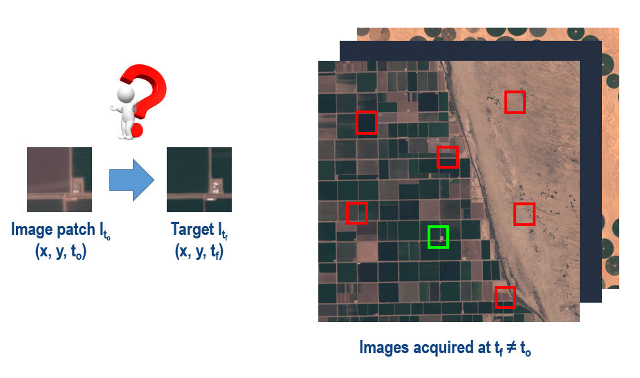

# Hackathon 2019
ISAE-SUPAERO Hackathon based on image location retrieval

# Description
The Hackathon description is available in `./Presentation`.

# Data
As explained during the presentation, you will work with Sentinel-2 image time series. The data is provided in [tfrecord format](https://www.tensorflow.org/tutorials/load_data/tf_records) which is a useful format when dealing with large amounts of data. For training your models, we selected 42 tiles containing several regions of interest such as the Amazon rainforest, the Dead Sea, the city of Los Angeles, the Great Sandy Desert, circular fields in Saudi Arabia, among others.

For each tile, we extracted 100 time series composed of 12 images of size 512 x 512 x 4 and saved them in one tfrecord file. Therefore, the training dataset is composed of 42 tfrecord files which will be available in a [Google Cloud Storage bucket](https://cloud.google.com/storage/docs/key-terms#buckets) on Monday March 4th.

The bucket address is `gs://hackathon-isae-2019/`. **In order to have access to the bucket please send me an email providing the Google account email you use for the Hackathon.**

Additionally, we provide you some code in order to recover the Sentinel-2 data from the bucket and to read the tfrecord files.

# Code
To run the code the following requirements are needed:

- Python 3.6
- numpy (run `pip install numpy`)
- imageio (run `pip install imageio`)
- SDK ([Install instructions](https://cloud.google.com/sdk/docs/downloads-apt-get))
- Tensorflow 1.12 ([Install instructions](https://www.tensorflow.org/install))

Note that most of the requirements are already fulfilled when using Google Compute Engine instances (in particular for SDK and Tensorflow where the installation might not be straightforward).

In order to recover the Sentinel-2 dataset, we provide an example in `./Code/launchers/launch_get_data_from_bucket.py`. It recovers the content of `gs://hackathon-isae-2019/` and save it in a local directory `~/Data` via the [gsutil](https://cloud.google.com/storage/docs/gsutil) tool.

In order to read the tfrecord files, we provide an example using the [tf.data.Dataset object](https://www.tensorflow.org/guide/datasets) in `./Code/launchers/launch_get_time_series.py`. In this case, we create a `dataset` of time series from the tfrecord files in `filenames`. Then, we sample some time series from the dataset and create an animated GIF.

# Submission

An example of CSV submission file is available in `./Submission`.
